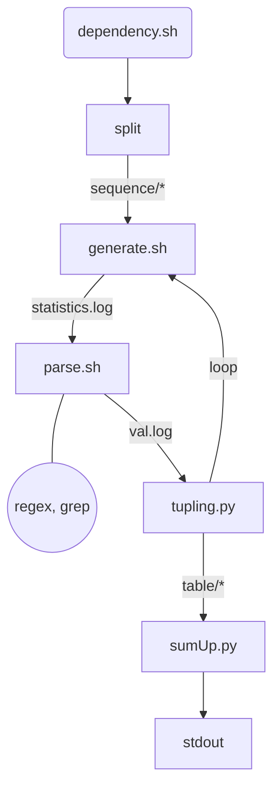
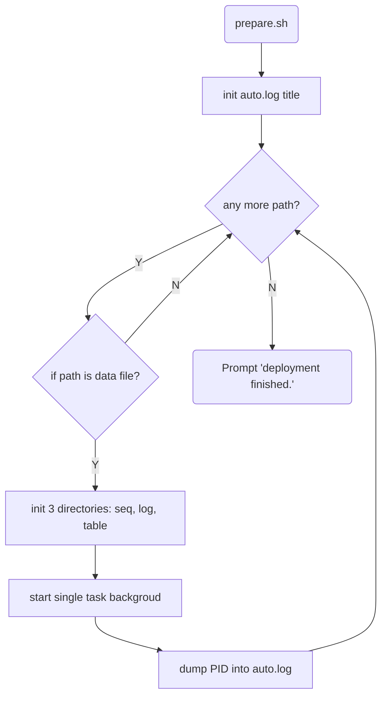

# Compression Analysis
This project aims to analyze the efficiency of 4 compression algorithms: lzw, zip, gzip, bzip2 over binary data.


## Structure
* auto.sh: script for multiple concurrent tasks
* auto.log: child process table
* prepare.sh:
	1) set up python interpreter;
	2) empty or create some directories, ex: seqSet, logSet, tableSet, bin;
	3) compile binaries;
* data/: directory for unit test

### script: directory for single task scripts
1. dependency.sh: check dependency and initialize  
2. generate.sh: run compress-decompress cmd and dump raw output into log/statistics.log  
3. parse.sh: extract useful information from log/statistics.log into line-based data log/val.log  
4. tupling.py: extract tuples from log/val.log and append them in table/\*.table(csv file)  
5. sumUp.py: show analysis info about specific csv file from directory table  

### bin: directory for binary executables
* cmpBinary: compare binary data files
* compress: ncompress algorithm exectuable
* parse: parse log/statistical.log, called by script parse.sh
* split: split arbitrary raw data into customized frames, being dumped into directory: sequence
* timer: estimate cmd execution time (measure)


## Description
### single task
`$ bash run.sh <dataPath> <framesize>`
##### implementation details of 'run.sh'


### multiple concurrent tasks
`$ bash auto.sh <dataDirPath> <framesize>`
##### implementation details of 'auto.sh'



## Unit test
### single task unit test
```bash
# in directory: .
$ bash prepare.sh
$ cd script.sh
# in directory: ./script
$ bash unit-test.sh
$ cd ..
# in directory: .
$ cat logSet/unitTestLog/*
$ cat tableSet/unitTestTable/*
```

### multiple tasks unit test 
```bash
# in directory: .
$ bash prepare.sh
$ bash unit-test-auto.sh
```


## To be continued...
add feature about 算上补零位;
